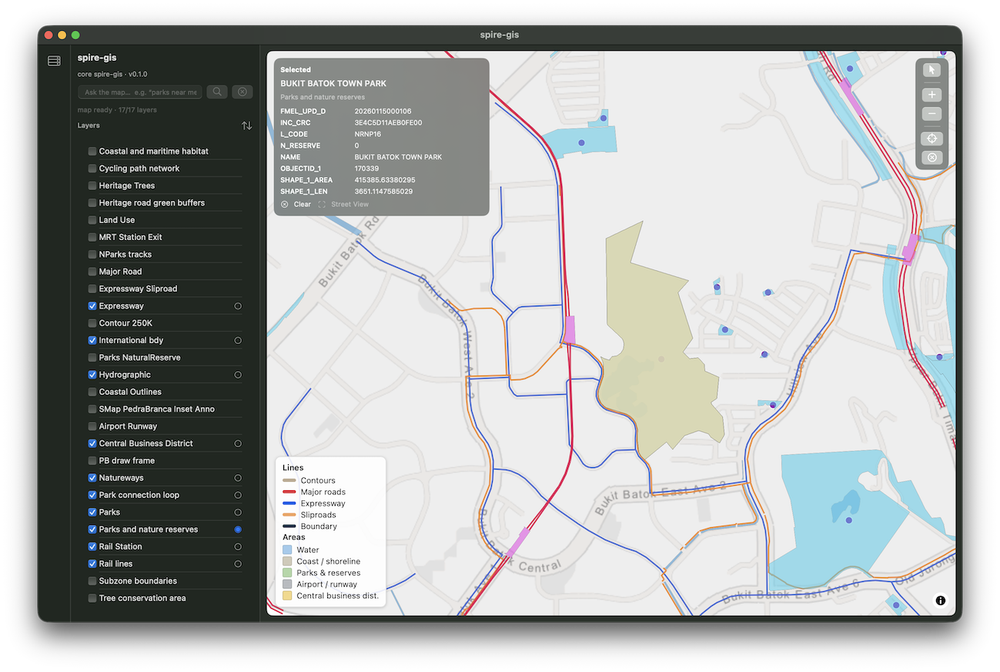

# spire-gis

<!-- SPDX-License-Identifier: GPL-3.0-or-later -->
<!-- Copyright (c) 2026 NatureSense -->

A macOS GIS application built on the Spire actor runtime (`spire-actor`) and
graph/vector store (`spire-core`). It imports GIS datasets (data.gov.sg GeoJSON
today), stores them in a graph database, and renders them on an interactive
MapLibre GL map driven by a SwiftUI host.



## Features

- **Configurable data sources** — persisted connectors (driver `kind` +
  provider config) with *Discover* (metadata + attribute schema) and *Fetch*
  (import) separated. Built-in **data.gov.sg** driver.
- **Layer catalog** — flat list of layers / sublayers, each with a visibility
  checkbox, plus a **stacking-order** control (persisted `z_order`).
- **Active click target** — pick which layer (or sublayer) receives map clicks
  so overlapping layers can't steal the selection.
- **Object and point selection** — select whole features, or switch to *point
  mode* which snaps to the nearest vertex (ideal for roads). Repeated clicks
  cycle through stacked features. Street View is offered for points / point
  picks only.
- **Spatial & natural-language queries** — viewport queries, a structured query
  DSL, an LLM-assisted NL → DSL translation, and vector **semantic search**
  over embedded feature text (place / district / area names are indexed).
- **Graph-native storage** — layers, features, data sources and attribute
  schemas are normalised graph nodes; no JSON blobs for configuration.

## Requirements

- macOS 14+ with Xcode command-line tools (Swift 5.10+).
- Rust toolchain (edition 2021).
- The sibling `spire-actor` and `spire-core` repositories checked out **next
  to** this repo (they are resolved by path in `Cargo.toml`).

```
parent/
├── spire-actor/
├── spire-core/
└── spire-gis/        ← this repository
```

## Build & run

```sh
make rust     # cargo build --release -p spire-gis   → target/release/libspire_gis.dylib
make swift    # cd ui/swift && swift build            → SwiftUI executable
make app      # assemble build/spire-gis.app
make run      # assemble + open the app
make clean    # remove build artifacts
```

`make app` runs `build/assemble-app.sh`, which bundles the Swift executable
with `libspire_gis.dylib` into `build/spire-gis.app`.

For quick iteration the dev build can be launched directly: the Swift host
looks for `libspire_gis.dylib` in the app's `Contents/Frameworks` **or** in
`<repo>/target/release/`.

### Notes

- Release builds **must not strip** (`strip = "none"` in the root
  `Cargo.toml`): stripping misaligns the LINKEDIT pool for cdylibs using
  chained fixups and `dlopen` then rejects the dylib.

## Data & logs

| Path | Purpose |
| --- | --- |
| `~/.spire/gis-data/` | Graph store snapshots + per-layer display GeoJSON cache |
| `~/.spire/gis-data/ui.log` | App-side diagnostic log (map status, queries, imports) |

Override the store location with `SPIRE_GIS_DATA_DIR`. Deleting the directory
resets the application to an empty state.

## Project layout

```
spire-gis/
├── crates/spire-gis/     Rust core (rlib + cdylib) — the FFI library
│   └── src/
│       ├── lib.rs             FFI (`spire_send_json`) + lazy AppState/init
│       ├── coordinator.rs     `gis/*` JSON method router
│       ├── config.rs          data-dir resolution
│       ├── actors/            ImportActor, LayerActor
│       ├── datasources/       DataSource model, drivers, graph store, actor
│       └── models/            Layer/Feature node builders + GeoJSON
├── ui/swift/             SwiftUI host (SwiftPM executable `SpireUI`)
└── docs/                 Design documentation
```

## Testing

```sh
cargo test -p spire-gis         # unit tests + integration test (datasources)
cd ui/swift && swift build      # compile-check the host
```

## Documentation

- [Architecture](docs/architecture.md)
- [Data model](docs/data-model.md)
- [Data sources](docs/datasources.md)
- [Import pipeline](docs/import-pipeline.md)
- [RPC API](docs/rpc-api.md)
- [Map UI](docs/map-ui.md)
- [Design overview](docs/design.md)

## License

GPL-3.0-or-later. See source headers (`SPDX-License-Identifier`).
